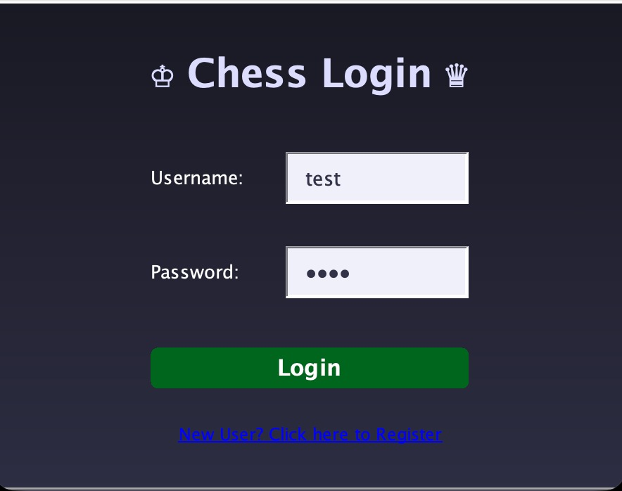
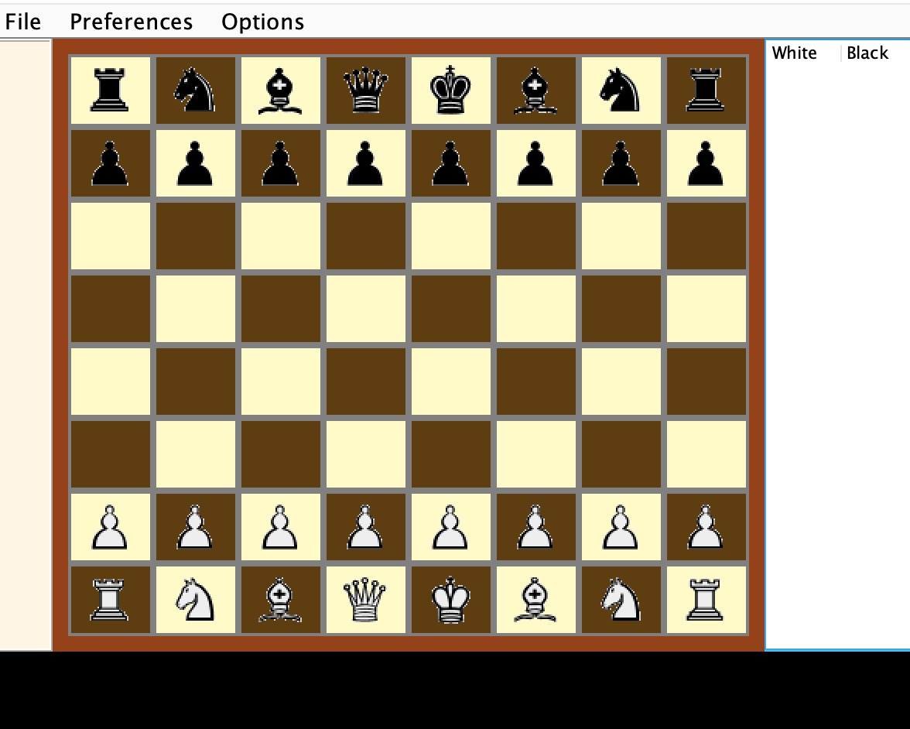
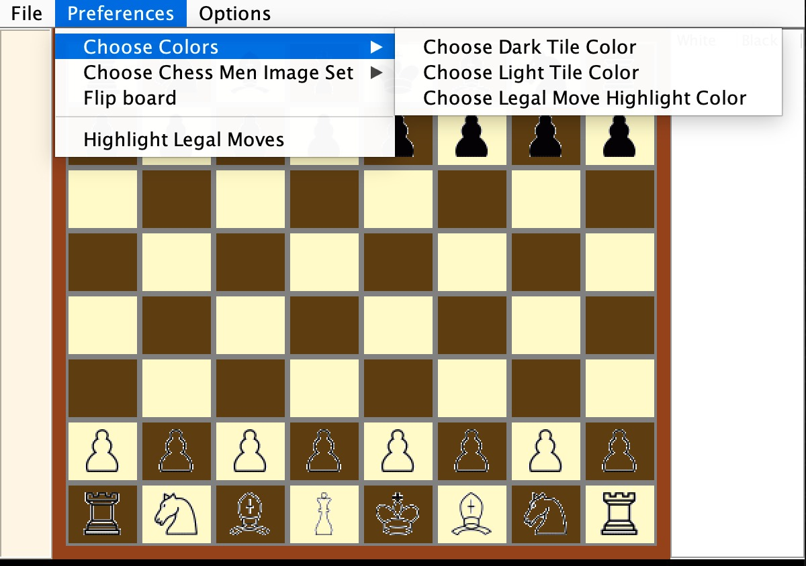
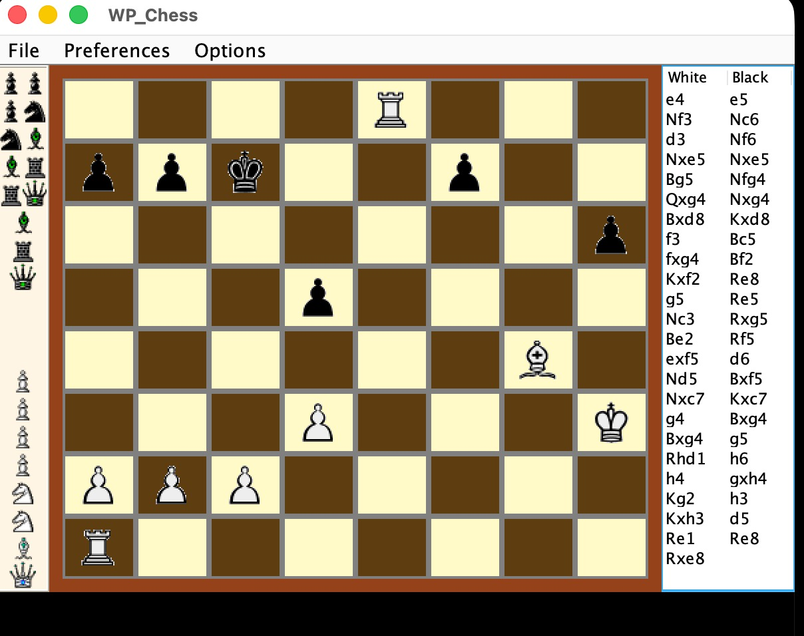

# Chess Engine in Java

[](https://adoptium.net/)
[](https://github.com/Tabish5858/Chess-Engine-In-Java/actions/workflows/java-ci.yml)
[](LICENSE)
[](https://github.com/Tabish5858/Chess-Engine-In-Java/commits/main)
[](https://github.com/Tabish5858/Chess-Engine-In-Java/issues)
[](https://github.com/Tabish5858/Chess-Engine-In-Java/stargazers)

A desktop chess engine and GUI application built with Java Swing.
It includes move validation, game history, configurable board visuals, and
login/registration flow backed by SQLite.

## Table of Contents

- [Highlights](#highlights)
- [Screenshots](#screenshots)
- [Project Layout](#project-layout)
- [Run Locally](#run-locally)
- [Default Test Login](#default-test-login)
- [Troubleshooting](#troubleshooting)
- [Contributing](#contributing)
- [Code of Conduct](#code-of-conduct)
- [Security](#security)
- [Support](#support)
- [License](#license)

## Highlights

- Swing chess UI with legal move highlighting
- Piece move engine for standard chess rules
- Board preferences menu for tile colors and piece themes
- Move history and captured pieces side panels
- SQLite-backed user login and registration

## Screenshots

<p align="center">
  
  
</p>

<p align="center">
  
  
</p>

## Project Layout

```text
Chess-Engine-In-Java/
|- JChess/
|  |- run_chess.sh
|  |- chess.db
|  |- src/com/chess/
|  |  |- JChess.java
|  |  |- engine/
|  |  |- gui/
|  |- art/
|- docs/screenshots/
|- .github/
```

## Run Locally

### Prerequisites

- macOS, Linux, or Windows with Java 17+
- `javac` and `java` available on `PATH`

### Option A: Quick Start (recommended)

```bash
cd JChess
./run_chess.sh
```

If script execution is blocked:

```bash
cd JChess
chmod +x run_chess.sh
./run_chess.sh
```

### Option B: Manual Compile and Run

```bash
cd JChess
javac -cp ".:guava-19.0.jar:sqlite-jdbc-3.36.0.3.jar" -d out -sourcepath src src/com/chess/JChess.java
java -cp "out:guava-19.0.jar:sqlite-jdbc-3.36.0.3.jar" com.chess.JChess
```

If your machine defaults to an older Java version, set Java 17 first:

```bash
export PATH="/opt/homebrew/opt/openjdk@17/bin:$PATH"
java -version
```

## Default Test Login

- Username: `test`
- Password: `test`

## Troubleshooting

- App does not launch: verify Java 17 with `java -version`.
- Compile errors about missing classes: make sure the JAR files exist inside
  `JChess/`.
- Database/login issues: confirm `JChess/chess.db` exists and is readable.
- Images not visible: verify files are present under `JChess/art/`.

## Contributing

Please follow [CONTRIBUTING.md](CONTRIBUTING.md) for setup, coding standards,
and PR checklist.

## Code of Conduct

Please review [CODE_OF_CONDUCT.md](CODE_OF_CONDUCT.md).

## Security

For responsible disclosure, follow [SECURITY.md](SECURITY.md).

## Support

For support channels and issue types, see [SUPPORT.md](SUPPORT.md).

## License

This project is licensed under the MIT License. See [LICENSE](LICENSE).
